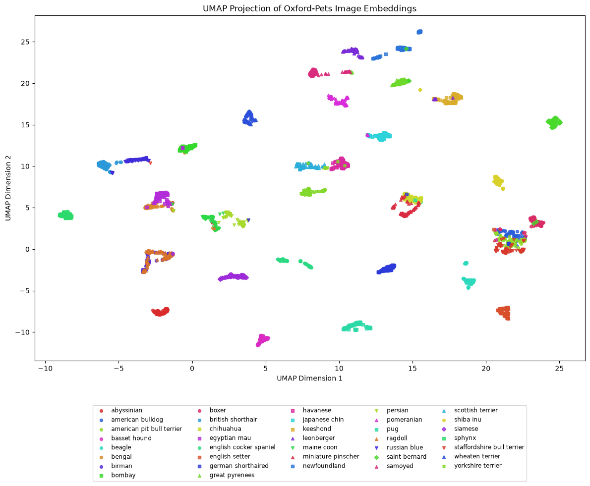
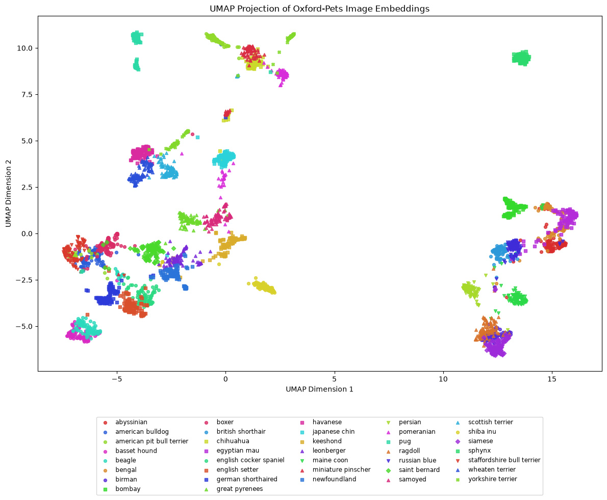

# SOTA Vision models embedding space visualization using UMAP

Current model embeddings tested:
- [facebook/dinov3-convnext-large-pretrain-lvd1689m](https://huggingface.co/facebook/dinov3-convnext-large-pretrain-lvd1689m)
- [facebook/MoEViE-B16-224](https://huggingface.co/facebook/MoEViE-B16-224)

## Examples
Dataset for testing::
[Oxford Pets dataset](https://www.robots.ox.ac.uk/~vgg/data/pets/)

### facebook/dinov3-convnext-large-pretrain-lvd1689m
UMAP embedding visualization (all train samples): 
[View code script](./dim_visualization_dinov3.py)

### facebook/MoEViE-B16-224
UMAP embedding visualization (all train samples): 
[View code script](./dim_visualization_moe_vie.py)

### TODO new models
